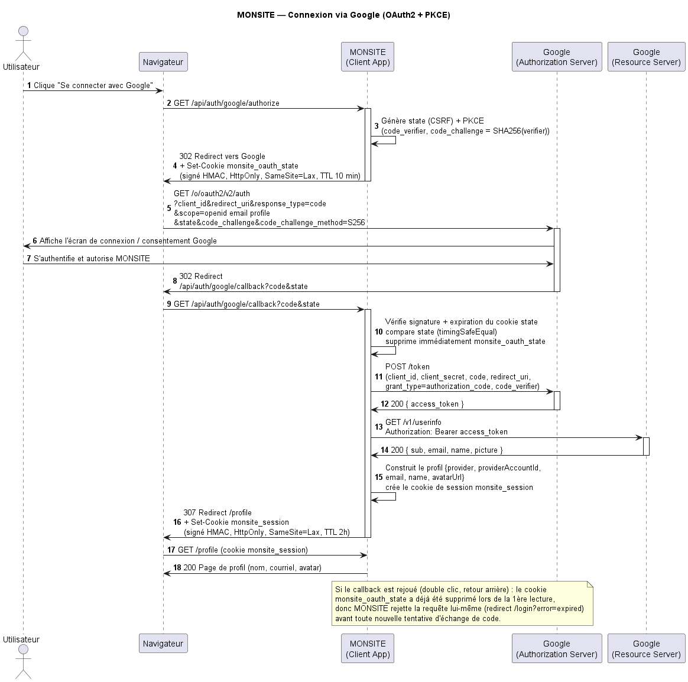
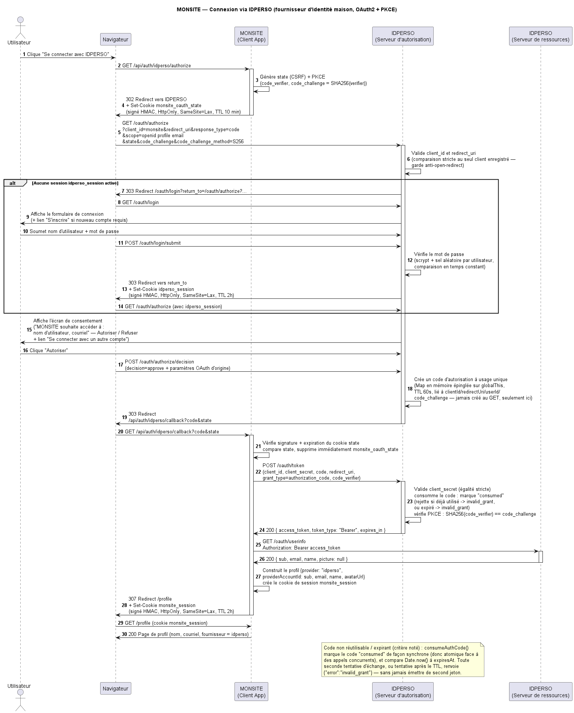

# Laboratoire 3 - Module d’authentification

GTI719 - Sécurité des réseaux d’entreprise
École de technologie supérieure Trimestre : Été 2025
Département de génie logiciel et des TI Professeur : Jean-Marc Robert
Version v1.0

---

## Module d’authentification
L’authentification est le processus par lequel l’identité d’un utilisateur accédant à un système ou à un réseau est vérifiée. Il permet de valider qu’un utilisateur est bien la personne qu’il prétend être. L’authentification se fait communément en utilisant un identifiant et un mot de passe que l’utilisateur est le seul à connaître.

Lorsque nous voulons développer un nouveau service web, deux choix s’offrent à nous. Développer une
nouvelle infrastructure d’authentification (base de données contenant les identifiants et les authentifiants
des utilisateurs) ou utiliser une infrastructure déjà existante (p.ex., Google et un autre de votre choix).

La gestion d’une session est le processus par lequel un serveur maintient l’état d’une communication avec un tiers. Le serveur doit retenir certaines informations lui permettant de savoir comment réagir aux différentes requêtes (p. ex., les HTML cookies d’une application web). La session est identifiée par un numéro qui est transmis entre le client et le serveur lors des requêtes. Cet identifiant se doit d'être unique pour chaque communication établie entre le serveur et un tiers.

---

## Partie 1 : utilisation d’un fournisseur d’identité externe (IdP)

L’objectif de la première partie est de développer un service web MONSITE permettant à vos utilisateurs de s’authentifier grâce à deux fournisseurs d’identités différents (Google et un autre de votre choix). À noter que vous devriez vous créer des comptes dédiés sur ces deux fournisseurs d’identités afin de ne pas exposer vos comptes personnels.

Pour y arriver, votre service web devra utiliser le protocole OAuth v2 afin d’interagir avec les fournisseurs d’identités. Attention, par exemple, les choix que Facebook et Google ont fait ne sont pas forcément compatibles.

Ainsi pour débuter, vous trouverez les détails pour Google à
• https://developers.google.com/identity/protocols/oauth2
• https://developers.google.com/identity/sign-in/web/reference#googleusergetbasicprofile

Ainsi, une fois authentifié, le fureteur de l’utilisateur aura un jeton (HTML cookie) qui lui permettra de maintenir un lien authentifié avec votre service web.
Pour ce laboratoire, vous devrez implémenter vos services web en Java, PHP, famille ASP de Microsoft (c#, vb, etc), JS, Python ou autre langage de programmation accepté par votre chargé de laboratoire.

Les frameworks que vous pouvez utiliser doivent utiliser les langages cités auparavant. L’utilisation des CMS (wordpress, joomla etc) n’est pas acceptée. Si vous n’êtes pas certains de votre choix, veuillez contacter le chargé de laboratoire.

Pour les personnes ayant peu d’expérience en développement web, PHP Laravel est un bon compromis. Particulièrement, le projet https://laravel.com/docs/9.x/passport. De plus, la documentation de PHP Laravel est simple (p. ex., https://laracasts.com/series/laravel-6-from-scratch).

Ainsi, voici le positionnement de votre service web MONSITE par rapport aux autres acteurs.

Clément Dumas a préparé une courte démo illustrant rapidement les attentes pour cette partie : 
- https://www.youtube.com/watch?v=UTmWmLz-TBk

---

## Partie 2 : développement d’un fournisseur d’identité simple

Dans un deuxième temps, vous devrez développer un fournisseur d’identités simple IDPERSO. Ce service web devra permettre à de nouveaux utilisateurs de s’enregistrer et de s’authentifier par la suite. La mise en œuvre de cet ensemble d’utilisateurs peut être très simple – fichier texte ou base de données, mots de passe chiffrés ou non. Ce n’est pas l’objectif principal de cette partie.

Ce nouveau fournisseur d’identités devra pouvoir être intégré au service web MONSITE développé dans la première partie. Pour y arriver, votre fournisseur d’identité IDPERSO devra utiliser le protocole OAuth v2 afin d’interagir avec votre service web MONSITE.

Il existe plusieurs options possibles lorsque vous mettez en œuvre un protocole aussi complexe que OAuth v2. Nous vous suggèrons de faire les mêmes choix que Google. Ainsi, la façon que votre service MONSITE interagit avec Google et celle avec laquelle il interagit avec IDPERSO devraient être interopérables.

Informations sur le laboratoire
- Quatre séances sont dédiées à ce laboratoire : 4, 11, 18 juin et 2 juillet.
- L'évaluation de l'application se fera pendant la TROISIÈME (18 juin) et la QUATRIÈME (2 juillet) séances de laboratoire.
  - Présence obligatoire en laboratoire pour ces deux évaluations
- Le rapport sera concis (maximum de 15 pages). Les éléments suivants sont exigés :
  1. Une introduction (max. une page) mettant en contexte le travail et annonçant le plan.
  2. Une section sur l’architecture à haut niveau du système complet. Les diagrammes de conception (p.ex, diagramme de classes et de séquences), l’architecture ainsi que les choix de conception et d'implémentation doivent être présentés.
- Le rapport de laboratoire devra être :
  - Remis le 10 juillet à18h (via Moodle).
  - La remise du code source (Partie I – Client (MONSITE) et Partie II – Serveur (IDPERSO)) peut être remis en partageant votre entrepôt de code avec le chargé de lab.
- Jusqu'à 10% de la note du rapport pourra être retiré pour la qualité du français et jusqu'à 5% pour le
non-respect des normes indiquées dans le document de remise.
- Aucune retard n’est permis.

---

## Pondération

| Critères                                                      | Pondération            |
|---------------------------------------------------------------|------------------------|
| **Introduction**                                              | **5%**                 |
| **Architecture à haut niveau**                                | **10%**                |
| **Partie 1 – Authentification**                               | **30%**                |
| &nbsp; • Remise code source MONSITE à la fin de la séance 3   | 10%                    | 
| &nbsp; • Authentification                                     | 15% 1 IDP et 20% 2 IDP |
| **Partie 2 – Authentification avec votre IdP**                | **20%**                | 
| **Conclusions**                                               | **5%**                 |
| **Bon fonctionnement (démonstration)**                        | **30%**                |
| &nbsp; • Fin séance 3                                         | 20%                    | 
| &nbsp;&nbsp; - Un IdP pour 10% et deux pour                   | 15%                    |
| &nbsp;&nbsp; - Code autorisation non réutilisable             | 2,5% (1,25% par IDP)   |
| &nbsp;&nbsp; - Expiration code d’autorisation                 | 2,5% (1,25% par IDP)   |
| &nbsp; • Fin séance 4 - avec IDPERSO                          | 10%                    | 
| &nbsp;&nbsp; - Fonctionnement                                 | 5%                     | 
| &nbsp;&nbsp; - Code autorisation non réutilisable             | 2.5%                   | 
| &nbsp;&nbsp; - Expiration code d’autorisation                 | 2.5%                   | 